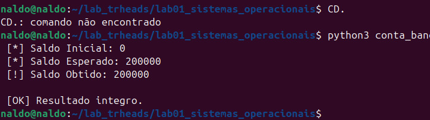
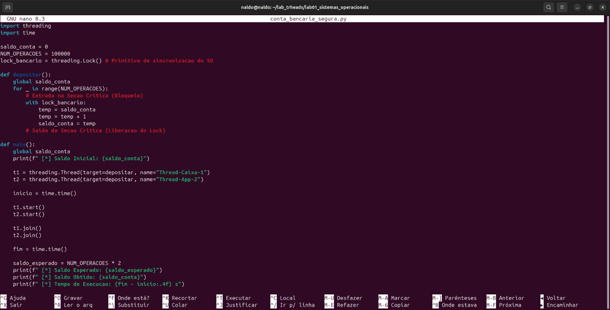
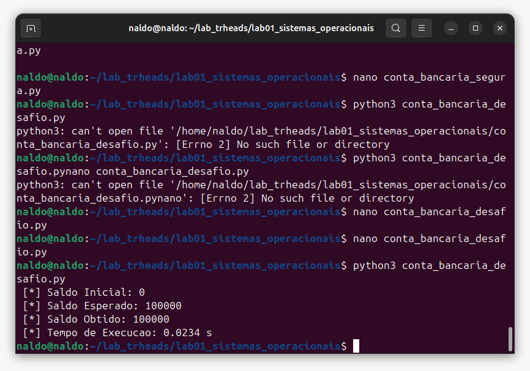

# Laboratório 01 — Concorrência, Threads e Seção Crítica (Race Condition)

**Instituição:** UNIFADESA — Análise e Desenvolvimento de Sistemas (ADS)
**Disciplina:** Sistemas Operacionais (2026.2) — 4º Semestre
**Docente:** Prof. Esp. Rodrigo Martins Sousa
**Aluno(a): Bruno santos da silva 
**Entrega:** 01/10/2026 

---

  Sobre o laboratório

Este repositório reúne os experimentos práticos sobre **concorrência com threads** e o **problema da seção crítica**. O objetivo é:

1. Provocar intencionalmente uma **condição de corrida (race condition)**;
2. Entender por que operações do tipo *ler → modificar → escrever* não são atômicas;
3. Corrigir o problema com uma primitiva de sincronização (**Mutex / `threading.Lock`**);
4. Resolver o desafio extra com 3 threads (depósitos e saques).

 Estrutura do repositório

```
lab01_sistemas_operacionais/
├── codigos/
│   ├── conta_bancaria_insegura.py   # Parte 1 - provoca a race condition
│   ├── conta_bancaria_segura.py     # Parte 2 - corrige com Lock (mutex)
│   └── conta_bancaria_desafio.py    # Bônus - 3 threads (2 depósitos + 1 saque)
├── imagens/                         # Capturas de tela das execuções
│   ├── execucao_insegura.jpeg
│   ├── execucao_segura.jpeg
│   ├── execucao_desafio.jpeg
│   └── codigo_segura_nano.jpeg
└── README.md
```

Como executar

Requisitos: Python 3 e um terminal Linux (testado no Ubuntu).

```bash
cd lab01_sistemas_operacionais
python3 codigos/conta_bancaria_insegura.py
python3 codigos/conta_bancaria_segura.py
python3 codigos/conta_bancaria_desafio.py
```

---

 Parte 1 — Provocando a condição de corrida

**Arquivo:** `codigos/conta_bancaria_insegura.py`

Duas threads (`Thread-Caixa-1` e `Thread-App-2`) executam `depositar()`, cada uma somando R$ 1,00 por 100.000 vezes na mesma variável global `saldo_conta`. O saldo esperado é **200.000**.

O trecho crítico, sem nenhuma proteção, é:

```python
temp = saldo_conta   # 1. LEITURA
temp = temp + 1      # 2. MODIFICAÇÃO
saldo_conta = temp   # 3. ESCRITA
```

### Evidência de execução



```
[*] Saldo Inicial: 0
[*] Saldo Esperado: 200000
[!] Saldo Obtido: 200000

[OK] Resultado integro.
```

 Observação importante sobre o resultado

Nesta execução o resultado saiu íntegro (200.000), ainda que o código seja **incorreto do ponto de vista de sincronização**. Isso não prova que a versão é segura: apenas mostra que a condição de corrida **não se manifestou nessa execução**. Isso acontece porque:

- O CPython possui o **GIL (Global Interpreter Lock)**, que permite que apenas uma thread execute bytecode por vez.
- A troca de thread só ocorre a cada *intervalo de troca* (`sys.getswitchinterval()`, padrão de 5 ms). Em versões recentes do Python, com 100.000 iterações por thread, uma thread pode terminar quase todo o trabalho dentro de uma única "fatia de tempo", tornando a intercalação rara.
- Ainda assim, o escalonador **pode** interromper a thread entre a leitura e a escrita, e o resultado deixa de ser garantido.

Para tornar a falha reproduzível, é possível aumentar `NUM_OPERACOES` (ex.: 5.000.000) ou reduzir o intervalo de troca no início do script:

```python
import sys
sys.setswitchinterval(1e-6)  # força trocas de contexto muito mais frequentes
```

---

 Parte 2 — Exclusão mútua com Mutex (Lock)

**Arquivo:** `codigos/conta_bancaria_segura.py`

A seção crítica é protegida com `threading.Lock()`. Somente uma thread por vez consegue executar o bloco dentro do `with lock_bancario:`.

```python
import threading
import time

saldo_conta = 0
NUM_OPERACOES = 100000
lock_bancario = threading.Lock()  # Primitiva de sincronização do SO

def depositar():
    global saldo_conta
    for _ in range(NUM_OPERACOES):
        # Entrada na Seção Crítica (Bloqueio)
        with lock_bancario:
            temp = saldo_conta
            temp = temp + 1
            saldo_conta = temp
        # Saída da Seção Crítica (Liberação do Lock)

def main():
    global saldo_conta
    print(f" [*] Saldo Inicial: {saldo_conta}")

    t1 = threading.Thread(target=depositar, name="Thread-Caixa-1")
    t2 = threading.Thread(target=depositar, name="Thread-App-2")

    inicio = time.time()
    t1.start()
    t2.start()

    t1.join()
    t2.join()
    fim = time.time()

    saldo_esperado = NUM_OPERACOES * 2
    print(f" [*] Saldo Esperado: {saldo_esperado}")
    print(f" [*] Saldo Obtido: {saldo_conta}")
    print(f" [*] Tempo de Execucao: {fim - inicio:.4f} s")

if __name__ == "__main__":
    main()
```

### Evidência (código no editor)



### Evidência de execução

> 📸 _Salve o print como `imagens/execucao_segura.jpeg` e troque este bloco por:_
> ``
>
> ```
> [*] Saldo Inicial: 0
> [*] Saldo Esperado: 200000
> [*] Saldo Obtido: 200000
> [*] Tempo de Execucao: X.XXXX s   <-- preencher com o seu valor
> ```

---

 Desafio Extra (Bônus) — 3 threads

**Arquivo:** `codigos/conta_bancaria_desafio.py`

Simulação com **3 threads**: duas realizando depósitos de R$ 1,00 e uma realizando saques de R$ 1,00, todas protegidas pelo mesmo Lock. Como há 200.000 depósitos e 100.000 saques, o saldo final esperado é **100.000**.

### Evidência de execução



```
[*] Saldo Inicial: 0
[*] Saldo Esperado: 100000
[*] Saldo Obtido: 100000
[*] Tempo de Execucao: 0.0234 s
```

 O saldo obtido coincide com o esperado, confirmando que o Lock garantiu a exclusão mútua entre as três threads.

---

 Questões do Relatório

### 1. Troca de Contexto e Atomicidade

A instrução `saldo_conta = saldo_conta + 1` parece uma única operação em alto nível, mas na prática é executada como **três etapas distintas** (no bytecode do Python e, mais abaixo, em várias instruções de máquina):

1. **LOAD** — ler o valor de `saldo_conta` da memória para um registrador/pilha;
2. **ADD** — somar 1 ao valor;
3. **STORE** — gravar o resultado de volta em `saldo_conta`.

Como essas etapas são separadas, **não formam uma operação atômica**. O escalonador do SO (ou o interpretador, no caso do GIL) pode realizar uma **troca de contexto** a qualquer momento, inclusive entre duas delas. Exemplo de intercalação problemática:

| Passo | Thread 1 | Thread 2 | `saldo_conta` |
|-------|----------|----------|---------------|
| 1 | `temp = saldo_conta` (lê 10) | | 10 |
| 2 | *(troca de contexto)* | `temp = saldo_conta` (lê 10) | 10 |
| 3 | | `temp = temp + 1` → 11 | 10 |
| 4 | | `saldo_conta = temp` (grava 11) | 11 |
| 5 | `temp = temp + 1` → 11 | | 11 |
| 6 | `saldo_conta = temp` (grava 11) | | **11** |

Duas somas foram feitas, mas o saldo só aumentou em 1: uma atualização foi **perdida** (*lost update*). Isso é uma **condição de corrida**: o resultado depende da ordem imprevisível em que as threads são escalonadas. Como as threads compartilham o mesmo espaço de endereçamento, ambas acessam a mesma variável, e a região que lê e escreve nela é uma **seção crítica** que exige exclusão mútua.

### 2. Custo do Lock

| Versão | Tempo de execução |
|--------|-------------------|
| Insegura (sem Lock) | _preencher (a versão insegura original não mede tempo; pode-se adicionar `time.time()`)_ |
| Segura (com Lock) | _preencher com o valor da sua execução_ |

O Lock adiciona **sobrecarga (overhead)** por vários motivos:

- **Custo de aquisição/liberação:** cada iteração executa `acquire()` e `release()`, que usam operações atômicas de hardware (ex.: *compare-and-swap*) e barreiras de memória, mais caras que um acesso comum.
- **Serialização:** a seção crítica só pode ser executada por uma thread de cada vez, eliminando o paralelismo naquele trecho.
- **Contenção e bloqueio:** quando uma thread encontra o lock ocupado, pode ser bloqueada e colocada em espera, o que envolve o escalonador e **trocas de contexto** adicionais (custosas por salvar/restaurar registradores, afetar cache e TLB).
- **Frequência:** neste laboratório o lock é adquirido 200.000 vezes, multiplicando o custo individual.

O ganho compensa: o overhead é o preço de garantir **correção** dos dados. Em sistemas reais, reduz-se esse custo mantendo a seção crítica **o menor possível** ou reduzindo a frequência de sincronização.

### 3. Desafio Extra

Resolvido em `codigos/conta_bancaria_desafio.py` (ver seção acima). Duas threads depositam e uma saca R$ 1,00, todas usando o mesmo `Lock`, resultando no saldo correto de 100.000.

---

 Conclusão

- Sem sincronização, o acesso concorrente a dados compartilhados é **incorreto por definição**, mesmo quando um teste isolado por acaso produz o valor esperado.
- O **Mutex (`Lock`)** garante a exclusão mútua na seção crítica e a integridade dos dados, ao custo de algum overhead de desempenho.
- A sincronização é um requisito fundamental em servidores web, APIs e sistemas de processamento paralelo.

Tecnologias

- Python 3
- Módulos `threading` e `time`
- Ubuntu Linux + editor `nano`
